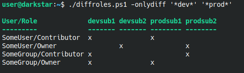

diffroles - script for visualizing differences in role assigments over multiple azure subscriptions.

## Usage

``Usage: ./diffroles.ps1 [-onlydiff] <subscriptions...>``

Example:

subscriptions: Mandatory argument, a list of multiple wildcards matched against subscriptions.

onlydiff: This flag will hide all role assignments that exists consistently through all matching subscriptions,
 and only show role asssignments that are inconsistent.

Make sure access to azure has been setup in powershell, using Connect-AzAccount.

## Pre-Reqs

Powershell Az module.

https://docs.microsoft.com/en-us/powershell/azure/install-az-ps